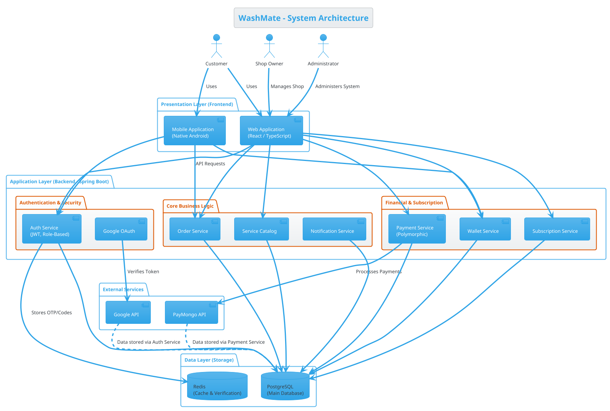

# WashMate - Updated System Architecture

This document contains the updated system architecture diagram for the WashMate project, reflecting the current implementation including the polymorphic payment system, digital wallet, and subscription features.

## PlantUML Source Code

## How to Render

You can render this diagram by:
1. Installing the PlantUML extension in VS Code.
2. Using the online PlantUML viewer at http://www.plantuml.com/plantuml.
3. Using the markdown preview if your environment supports PlantUML rendering.
