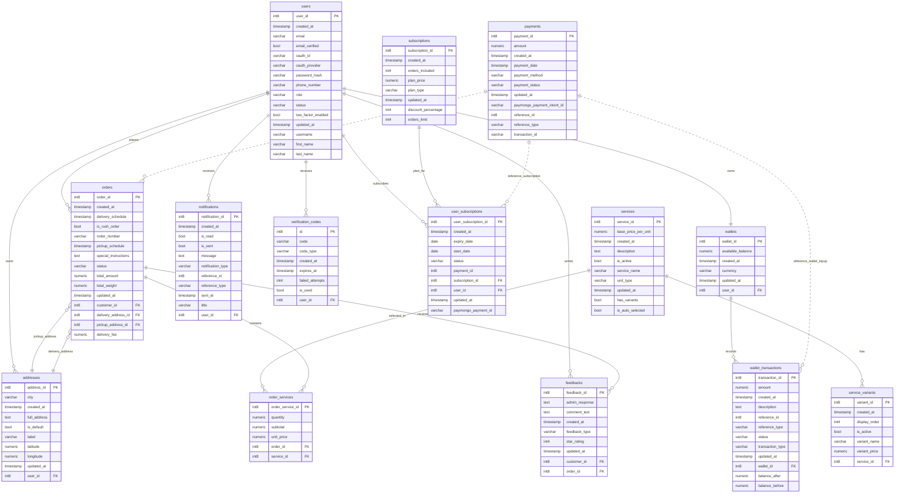

# WashMate Database ERD for Presentation

Use this ERD for the presentation. It is aligned with the Supabase tables shown in your screenshots.

## Recording Cue

Use this diagram after the architecture diagram. Emphasize:

- `users` connects to customer data, orders, wallets, notifications, verification codes, subscriptions, and feedback.
- `orders` connects to selected services through `order_services`.
- `payments` uses `reference_type` and `reference_id` so it can support order payments, subscription payments, and wallet top-ups.
- `feedbacks` stores only the delivered order review data: rating, comment, optional admin response, customer, and order.
