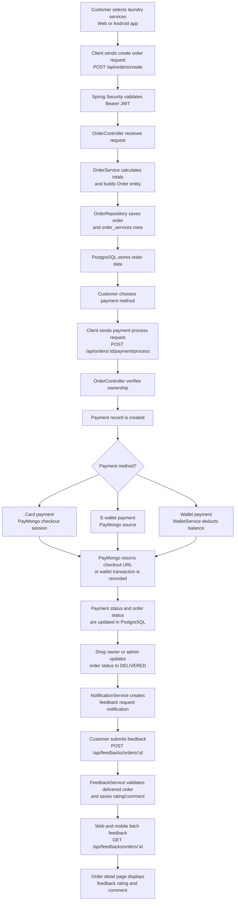

# WashMate Order, Payment, Notification, and Feedback Flow

Use this diagram when explaining component interaction and data flow. This version uses a Mermaid flowchart because it is more reliable across Markdown previewers than a sequence diagram with REST paths.

## Recording Cue

Show this diagram before or during the demo. Then demonstrate:

- Creating or viewing an order.
- Processing or showing payment.
- Updating or viewing delivered status.
- Submitting or displaying feedback.

Connect each visible UI action to the backend endpoint and database action.
