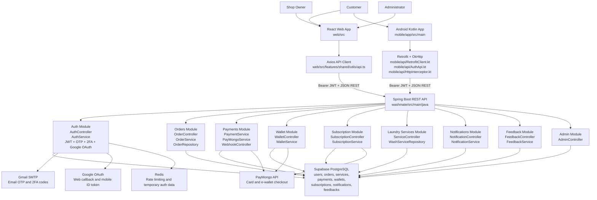

# WashMate System Architecture Diagram

Use this diagram during the architecture section of the presentation.

## Recording Cue

Show this diagram while explaining:

- React web and Android mobile are the clients.
- Spring Boot is the central REST API.
- PostgreSQL stores persistent data.
- PayMongo, Gmail SMTP, Google OAuth, and Redis are external/infrastructure integrations.
- Backend modules are separated by feature and follow controller-service-repository structure.
